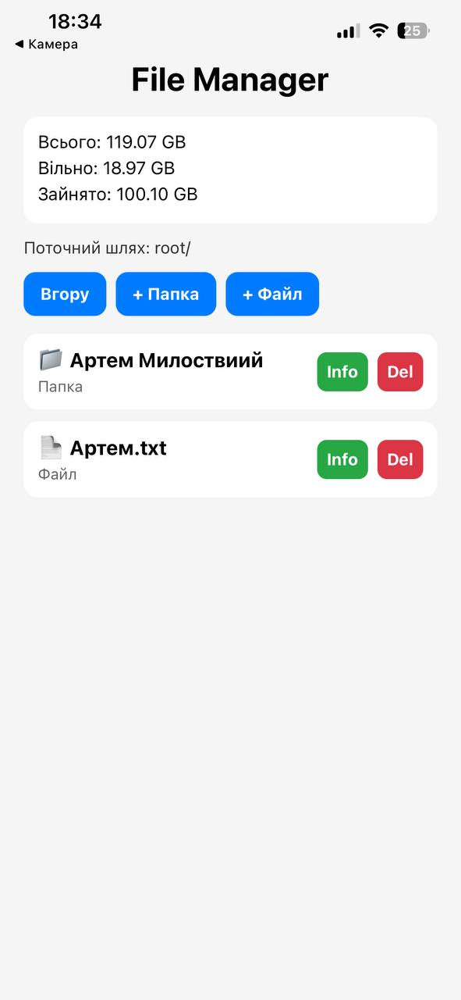
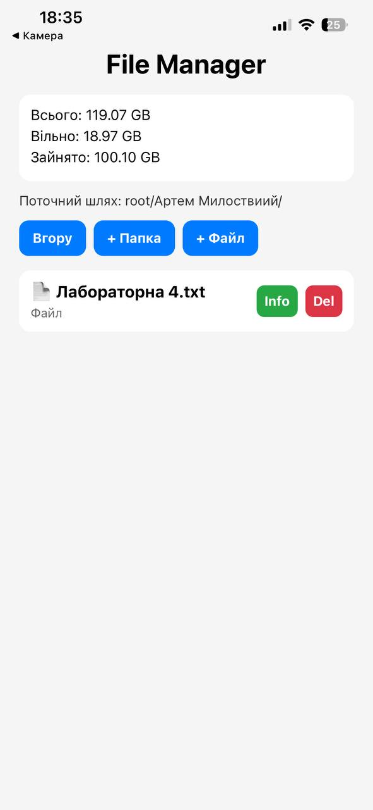
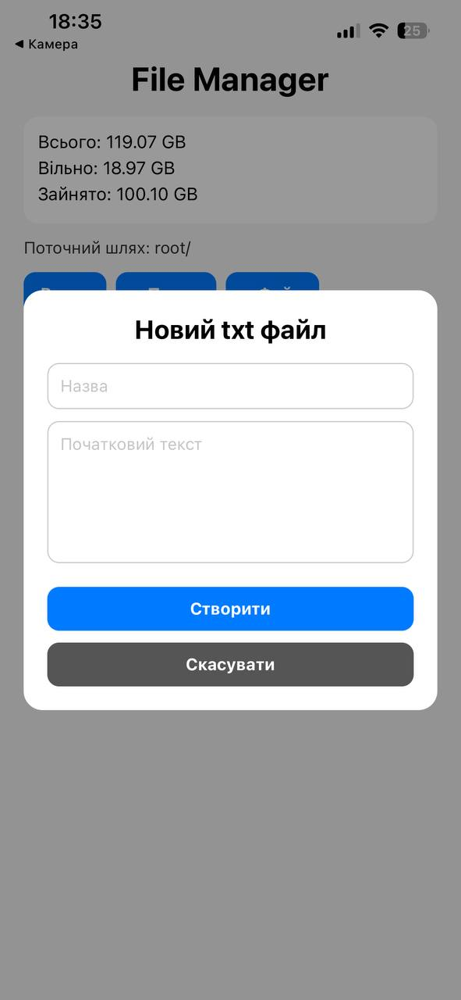
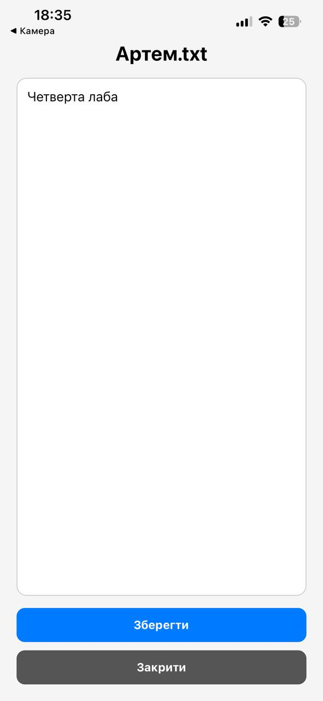

cd lab5# Лабораторна робота №4

## Тема

Робота з файловою системою в React Native з використанням бібліотеки expo-file-system.

## Мета

Опанувати механізми роботи з локальною файловою системою мобільного пристрою, використовуючи можливості бібліотеки expo-file-system. Закріпити навички реалізації базових операцій над файлами й папками, організації файлової навігації та аналізу стану файлової системи.

---

# Запуск проєкту


## Встановлення залежностей
```bash
npm install
```

Запуск Expo
```bash
npx expo start
```

#### Після запуску необхідно відсканувати QR-код через Expo Go.

## Реалізований функціонал
#### Навігація по файловій системі

#### У застосунку реалізовано:

- відображення поточного шляху;
- перегляд вмісту директорії;
- перехід у вкладені папки;
- перехід назад до попередньої директорії;
- сортування папок і файлів.
- Створення файлів і папок

#### Реалізовано:

- створення нових папок;
- створення текстових .txt файлів;
- введення початкового тексту для файлу;
- модальні вікна для введення даних.
  
## Робота з файлами

#### Реалізовано:

- відкриття .txt файлів;
- перегляд тексту файлу;
- редагування вмісту;
- збереження змін.

## Видалення

#### Реалізовано:

- видалення файлів;
- видалення папок;
- підтвердження перед видаленням.
- Інформація про файл

#### Для кожного файлу або папки відображається:

- назва;
- тип;
- розмір;
- дата останньої модифікації.
- Статистика памʼяті пристрою

#### На головному екрані виводиться:

- загальний обсяг памʼяті;
- обсяг вільного місця;
- обсяг зайнятого місця.
- Використані технології
- React Native
- Expo
- expo-file-system
- FlatList
- Modal
- TextInput

## Скріншоти роботи
#### Головний екран



#### Всередині папки



#### Новий txt файл



#### Інформація про файл



# Висновок

У ході виконання лабораторної роботи було реалізовано мобільний застосунок для роботи з локальною файловою системою пристрою. Було опрацьовано створення, відкриття, редагування та видалення файлів і папок за допомогою бібліотеки expo-file-system. Також було реалізовано навігацію по файловій системі, перегляд інформації про файли та статистику пам’яті пристрою. У результаті було закріплено навички роботи з файловою системою у React Native.

